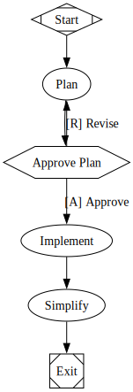
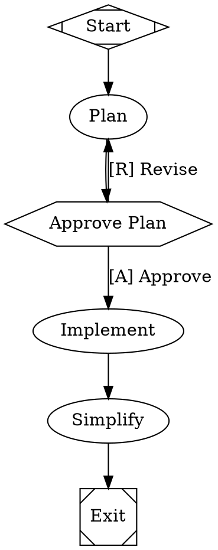

<div align="left" id="top">
<a href="https://docs.fabro.sh"></a>
</div>

## The open source dark software factory for expert engineers

AI coding agents are powerful but unpredictable. You either babysit every step or review a 50-file diff you don't trust. Fabro gives you a middle path: define the process as a graph, let agents execute it, and intervene only where it matters. [Why Fabro?](https://docs.fabro.sh/getting-started/why-fabro)

[](LICENSE.md)
[](https://docs.fabro.sh)

```bash
# With Claude Code
curl -fsSL https://fabro.sh/install.md | claude

# With Codex
codex "$(curl -fsSL https://fabro.sh/install.md)"

# With Bash
curl -fsSL https://fabro.sh/install.sh | bash
```


---

## Use Cases

- **Extend disengagement time** — Stop babysitting an agent REPL. Define a workflow with verification gates and walk away — Fabro keeps the process on track without you.
- **Leverage ensemble intelligence** — Seamlessly combine models from different vendors. Use one model to implement, another to cross-critique, and a third to summarize — all in a single workflow.
- **Share best practices across your team** — Collaborate on version-controlled workflows that encode your software processes as code. Review, iterate, and reuse them like any other source file.
- **Reduce token bills** — Route cheap tasks to fast, inexpensive models and reserve frontier models for the steps that need them. CSS-like stylesheets make this a one-line change.
- **Improve agent security** — Run agents in cloud sandboxes with full network and filesystem isolation. Keep untrusted code off your laptop and out of your production environment.
- **Run agents 24/7** — Fabro's API server queues and executes runs continuously. Close your laptop — workflows keep running and results are waiting when you return.
- **Scale infinitely** — Move execution off your laptop and into cloud sandboxes. Run as many concurrent workflows as your infrastructure allows.
- **Guarantee code quality** — Layer deterministic verifications — test suites, linters, type checkers, LLM-as-judge — into your workflow graph. Failures trigger fix loops automatically.
- **Achieve compounding engineering** — Automatic retrospectives after every run feed a continuous improvement loop. Your workflows get better over time, not just your code.
- **Specify in natural language** — Define requirements as natural-language specs and let Fabro generate — and regenerate — implementations that conform to them.

---

## Key Features

|     | Feature                        | Description                                                                                           |
| --- | ------------------------------ | ----------------------------------------------------------------------------------------------------- |
| 🔀  | Deterministic workflow graphs  | Define pipelines in Graphviz DOT with branching, loops, parallelism, and human gates. Diffable, reviewable, version-controlled |
| 🙋  | Human-in-the-loop              | Approval gates pause for human decisions. Steer running agents mid-turn. Interview steps collect structured input |
| 🎨  | Multi-model routing            | CSS-like stylesheets route each node to the right model and provider, with automatic fallback chains  |
| ☁️  | Cloud sandboxes                | Run agents in isolated Daytona cloud VMs with snapshot-based setup, network controls, and automatic cleanup |
| 🔌  | SSH access and preview links   | Shell into running sandboxes with `fabro ssh` and expose ports with `fabro preview` for live debugging    |
| 🌲  | Git checkpointing              | Every stage commits code changes and execution metadata to Git branches. Resume, revert, or trace any change |
| 📊  | Automatic retros               | Each run generates a retrospective with cost, duration, files touched, and an LLM-written narrative   |
| ⚡  | Comprehensive API              | REST API with SSE event streaming and a React web UI. Run workflows programmatically or as a service  |
| 🦀  | Single binary, no runtime      | One compiled Rust executable with zero dependencies. No Python, no Node, no Docker required           |
| ⚖️  | Open source (MIT)              | Full source code, no vendor lock-in. Self-host, fork, or extend to fit your workflow                  |

---

## Raspberry Supervisory Plane

This repository now contains two layers:

- **Fabro** — the workflow execution substrate
- **Raspberry** — the supervisory plane above it

Fabro runs individual staged workflows. Raspberry supervises whole repository
programs made of units, lanes, milestones, proof checks, child programs, and
autonomous execution loops.

If you are trying to understand "what all the new control-plane work does", the
short version is:

- `fabro/programs/*.yaml` declares supervised programs
- Raspberry evaluates lane readiness from dependencies, checks, and durable artifacts
- `raspberry execute` dispatches ready work
- `raspberry autodev` runs bounded autonomous cycles over a real repo/worktree
- Paperclip mirrors the live frontier into a browser-based coordination dashboard
- `raspberry tui` remains available as an optional terminal observer
- `fabro synth import/create/evolve` now manages repo-shaped `fabro/` packages
- implementation-family lanes now use deterministic `quality.md` and
  `promotion.md` gates instead of trusting prose-only completion

The main Raspberry operator commands are:

```bash
raspberry plan --manifest fabro/programs/<program>.yaml
raspberry status --manifest fabro/programs/<program>.yaml
raspberry watch --manifest fabro/programs/<program>.yaml
raspberry execute --manifest fabro/programs/<program>.yaml
raspberry autodev --manifest fabro/programs/<program>.yaml
```

The main Paperclip coordination commands are:

```bash
fabro paperclip bootstrap --target-repo /path/to/repo --program <program>
fabro paperclip status --target-repo /path/to/repo --program <program>
fabro paperclip wake --target-repo /path/to/repo --program <program> --agent raspberry-orchestrator
fabro paperclip refresh --target-repo /path/to/repo --program <program>
```

The preferred human dashboard is the Paperclip web UI served by that local
instance. By default it comes up on `http://127.0.0.1:3100/`, with the synced
company dashboard mounted under its company prefix.

The main synthesis commands are:

```bash
fabro synth import --target-repo /path/to/repo --program <program> --output /tmp/program.yaml
fabro synth create --blueprint fabro/blueprints/craps.yaml --target-repo .
fabro synth evolve --blueprint /tmp/program.yaml --target-repo /path/to/repo
```

### What Raspberry Adds

| Capability | What it means |
| --- | --- |
| Program manifests | One repo can be modeled as units, lanes, artifacts, milestones, and child programs |
| Lane readiness | Raspberry decides what is blocked, ready, running, failed, or complete |
| Durable operator truth | `.raspberry/*-state.json` and `*-autodev.json` record program-level state over time |
| Bounded autodev | Autonomous cycles dispatch ready work, evolve the package when appropriate, and stop cleanly |
| Blueprint-first synthesis | Repo workflow trees are imported, created, and evolved through deterministic blueprints |
| Implementation quality gates | `quality.md` records placeholder debt, warning debt, artifact mismatch risk, and manual follow-up before promotion |
| Paperclip web dashboard | A synced browser UI for frontier status, coordination, wake/refresh loops, and artifact visibility |
| Optional terminal observer | `raspberry tui` remains available for local lane/artifact diagnosis in the terminal |

### The Mental Model

```text
requirements/specs/doctrine
        |
        v
  blueprint (synth import/create/evolve)
        |
        v
checked-in fabro/ package
        |
        v
 raspberry supervisor
        |
        +--> outputs/**/*
        +--> .raspberry/*-state.json
        +--> .raspberry/*-autodev.json
        +--> ~/.fabro/runs/<run-id>
```

For the full walkthrough, read:

- [From Specs to Blueprints](https://docs.fabro.sh/guides/from-specs-to-blueprint)
- [Raspberry Supervisory Plane](https://docs.fabro.sh/reference/raspberry)
- [Raspberry Operator Runbook](https://docs.fabro.sh/guides/raspberry-operator-runbook)

---

## Example Workflow

A plan-approve-implement workflow where a human reviews the plan before the agent writes code:





Agents run as multi-turn LLM sessions with tool access. Human gates (`hexagon`) pause for approval. The stylesheet routes planning to a cheap model and coding to a frontier model. See the [Graphviz DOT language reference](https://docs.fabro.sh/reference/dot-language) for the full syntax.

---

## 📖 Documentation

Fabro ships with [comprehensive documentation](https://docs.fabro.sh) covering every feature in depth:

- [**Getting Started**](https://docs.fabro.sh/getting-started/introduction) -- Installation, first workflow, and why Fabro exists
- [**Defining Workflows**](https://docs.fabro.sh/workflows/stages-and-nodes) -- Node types, transitions, variables, stylesheets, and human gates
- [**Executing Workflows**](https://docs.fabro.sh/execution/run-configuration) -- Run configuration, sandboxes, checkpoints, retros, and failure handling
- [**Tutorials**](https://docs.fabro.sh/tutorials/hello-world) -- Step-by-step guides from hello world to parallel multi-model ensembles
- [**API Reference**](https://docs.fabro.sh/api-reference/overview) -- Full OpenAPI spec with authentication, SSE events, and client SDKs

---

## Quick Start

### Install

```bash
# With Claude Code
curl -fsSL https://fabro.sh/install.md | claude

# With Codex
codex "$(curl -fsSL https://fabro.sh/install.md)"

# With Bash
curl -fsSL https://fabro.sh/install.sh | bash
```

Then initialize Fabro in your project:

```bash
fabro install          # one-time setup

cd my-project
fabro init             # per project
```

---

## Help or Feedback

- [Bug reports](https://github.com/fabro-sh/fabro/issues) via GitHub Issues
- [Feature requests](https://github.com/fabro-sh/fabro/discussions) via GitHub Discussions
- Email [bryan@qlty.sh](mailto:bryan@qlty.sh) for questions
- See [CONTRIBUTING.md](CONTRIBUTING.md) for build instructions and development workflow

---

## License

Fabro is licensed under the [MIT License](LICENSE.md).
