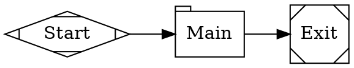

# Fabro Workflow DOT Reference

Use this reference for the graph itself. Use
`raspberry-authoring.md` for the repo contract around the graph.

## Required Structure

Every Fabro workflow is a directed graph:



Required rules:

- use `digraph`, not `graph` or `strict`
- set `graph [goal="..."]`
- define exactly one start node and one exit node
- make every useful node reachable from the start node

## Node Shapes

| Shape | Meaning | Use for |
|---|---|---|
| `Mdiamond` | Start | workflow entry |
| `Msquare` | Exit | workflow terminal |
| `box` | Agent | tool-using implementation or fixup |
| `tab` | Prompt | one-shot planning, review, synthesis |
| `parallelogram` | Command | tests, lint, build, probes |
| `diamond` | Conditional | routing only |
| `hexagon` | Human | approval or choice gate |
| `component` | Parallel fan-out | independent branches |
| `tripleoctagon` | Fan-in | merge parallel branches |
| `insulator` | Wait | sleep or delay |
| `house` | Sub-workflow manager | orchestration of child workflows |

## Key Node Attributes

### All nodes

- `label`
- `class`
- `timeout`
- `max_visits`
- `max_retries`
- `retry_policy`
- `retry_target`
- `goal_gate`

### Agent and prompt nodes

- `prompt`
- `reasoning_effort`
- `max_tokens`
- `fidelity`
- `thread_id`
- `model`
- `provider`
- `backend`

### Command nodes

- `script`
- `language`

### Parallel fan-out nodes

- `join_policy`
- `error_policy`
- `max_parallel`

## Routing Rules

Use these patterns:

- command success gate:
  `validate -> exit [condition="outcome=success"]`
- unconditional fallback:
  `validate -> fixup`
- bounded repair loop:
  set `max_visits=3` on the fix node or use retry policy

Rules that matter in practice:

- `diamond` nodes route only; they do not have prompts
- conditional routing requires multiple outgoing edges
- `goal_gate=true` is appropriate for a must-pass verification step
- if a goal gate can fail, give it a retry target directly or at graph level

## Model Assignment

Prefer `model_stylesheet` over hand-assigning models on every node:

```dot
graph [model_stylesheet="
    *        { model: claude-haiku-4-5; reasoning_effort: low; }
    .coding  { model: claude-sonnet-4-6; reasoning_effort: high; }
    .review  { model: gpt-5.4; reasoning_effort: high; }
"]
```

Rules:

- `*` sets the default
- `.class` targets role-based groups
- `#node_id` targets one node
- use semicolons between properties
- explicit node attributes override the stylesheet

Always run `fabro model list` before naming a concrete model.

## Variables and Prompt Files

- define variables in TOML `[vars]`
- use them in DOT as `$name`
- use `$$` for a literal dollar sign
- use `prompt="@prompts/plan.md"` for long prompts

`@file` paths resolve relative to the DOT file.

## Validator Rules To Respect

The built-in validator checks at least these rules:

- exactly one start node
- exactly one exit node
- no incoming edges to start
- no outgoing edges from exit
- every edge target exists
- condition syntax parses
- stylesheet syntax parses
- LLM nodes have prompts
- `@file` references resolve
- `goal_gate` nodes have a retry path
- selection rules do not conflict with conditional routing

Use `fabro validate workflow.fabro` for graph-only validation and
`fabro run --preflight run.toml` for full run-config validation.

## Topology Hints

Use the smallest topology that matches the work:

- `tab -> exit` for a one-shot plan or summary
- `command -> tab -> exit` when shell output needs analysis
- `implement -> validate -> fix -> validate` for code loops
- `fork -> branches -> merge -> synthesize` for independent analyses
- `plan -> human -> implement` when approval matters

For Raspberry lanes, choose the topology only after deciding what milestone and
artifacts the lane owns.
