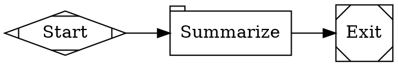
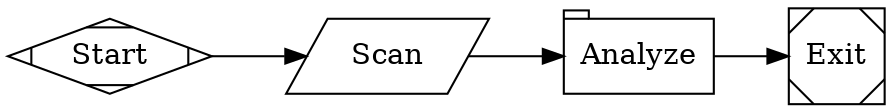
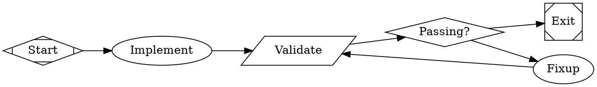
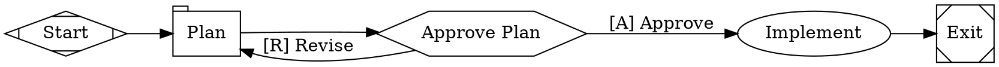
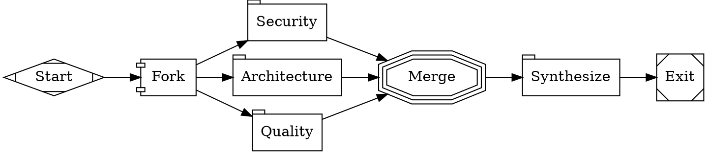
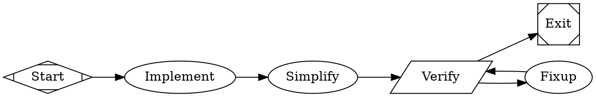

# Fabro Workflow Topology Examples

Use these as generic Fabro patterns. For supervisory-plane lane design, also
read `raspberry-examples.md`.

## 1. Linear Prompt

Use for a one-shot plan, review, or summary.

## 2. Command Then Analyze

Use when shell output is the input to a prompt step.

## 3. Implement / Validate / Fix Loop

Use when the workflow must repair itself until tests pass.

## 4. Plan, Approve, Implement

Use when a human should review the plan before changes land.

## 5. Parallel Review

Use when multiple perspectives can work independently.

## 6. Production Verification Gate

Use when the workflow must produce a must-pass final verification.

## Choosing Between Them

Pick the smallest pattern that answers the user's actual problem:

- one-shot thinking: linear prompt
- shell evidence plus analysis: command then analyze
- self-repairing code change: validate / fix loop
- human approval required: plan, approve, implement
- multiple independent viewpoints: parallel review
- must-pass release criteria: production verification gate

For Raspberry-supervised repos, choose the pattern only after deciding the
lane's milestone, produced artifacts, proof expectations, and observability
contract.

For create-mode bootstrap from an accepted plan, narrow this further. The
workflow family should usually be chosen from this fixed catalog:

- `bootstrap`
- `service_bootstrap`
- `implementation`
- `recurring_report`
- `orchestration`

Treat the other patterns in this document as supporting ingredients, not as
the first decision surface for repo bootstrap.

## 7. Implementation Evidence Gate

Use for implementation-family lanes that must justify merge-worthiness with
deterministic evidence before a single settlement judgment and final audit.

```dot
digraph ImplementationEvidenceGate {
    graph [goal="Implement a bounded slice and prove merge readiness honestly"]
    rankdir=LR

    start [shape=Mdiamond, label="Start"]
    exit  [shape=Msquare, label="Exit"]

    preflight       [shape=parallelogram, label="Preflight", script="set +e\ncargo test -p my-crate\ntrue"]
    implement       [label="Implement", prompt="Implement only the approved next slice."]
    verify          [shape=parallelogram, label="Verify", script="cargo test -p my-crate", goal_gate=true, retry_target="fixup"]
    quality         [shape=parallelogram, label="Quality", script="./scripts/write-quality-pack.sh", goal_gate=true, retry_target="fixup"]
    settle          [label="Settle", prompt="Write promotion.md only if quality.md and verification evidence justify merge readiness."]
    audit           [shape=parallelogram, label="Audit", script="test -f outputs/foo/implementation.md && test -f outputs/foo/verification.md && test -f outputs/foo/quality.md && test -f outputs/foo/promotion.md && grep -Eq '^merge_ready: yes$' outputs/foo/promotion.md && grep -Eq '^quality_ready: yes$' outputs/foo/quality.md", goal_gate=true, retry_target="fixup"]
    fixup           [label="Fixup", prompt="Fix only the issues exposed by verify/quality/settle/audit."]

    start -> preflight -> implement -> verify
    verify -> quality [condition="outcome=success"]
    verify -> fixup
    quality -> settle [condition="outcome=success"]
    quality -> fixup
    settle -> audit [condition="outcome=success"]
    settle -> fixup
    audit -> exit [condition="outcome=success"]
    audit -> fixup
    fixup -> verify
}
```

Prefer this pattern over a simpler implement/verify/promote loop when the lane
is expected to claim `merge_ready`, when prior runs have produced optimistic
artifacts, or when the code touches trust boundaries.

Do not use this as the first family for every plan. Only choose it when the
repo already has enough reviewed context and a real deterministic proof command
for the slice.
